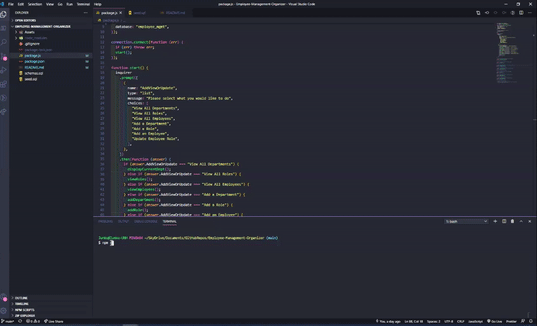

# Employee-Management-Organizer


## Description
Developers often face tasks with creating interfaces that make it easy for non-developers to view and interact with information stored in databases. Often these interfaces are known as **C**ontent **M**anagement **S**ystems. This application welcomes company employees to manage their teams by using node, inquirer and mySQL.

## Table of Contents
* [Installation](#Installation)
* [Demonstration](#Demonstration)
* [Technologies Used](#Technologies-Used)
* [Packages Used](#Technologies-Used)
* [My Learnings](#My-Learnings)


## Installation

```
$ git clone https://github.com/junkoyama/Employee-Management-Organizer.git

$ cd Employee-Management-Organizer/

$ npm install

$ npm start
```
## Demonstration

</br>

#### How to View All Departments, Roles, and Employees:
</br>




#### How to Add New Department, Role, Employee:
</br>

Waiting to work with TA on fixing the node issue

#### How to Update an Employee:
</br>

Waiting to work with TA on fixing the node issue
## Technologies Used
* Javascript
* Node
* mySQL
## Packages Used

```javascript
"dependencies": {
    "inquirer": "^6.2.1",
    "mysql": "^2.16.0"
  }
```

## My Learnings

:white_check_mark: Configure a Node.js application to connect to a MySQL instance
</br>
:white_check_mark: Create and drop databases and tables
</br>
:white_check_mark: Explain and execute CRUD methods
</br>
:white_check_mark: Create schema and seed files for development and production

[Return to Top](#Express-Note-Taker)